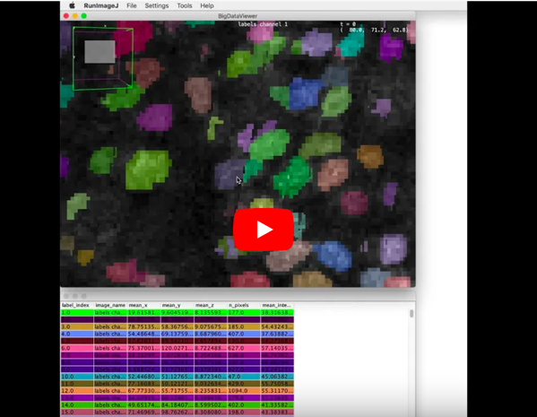
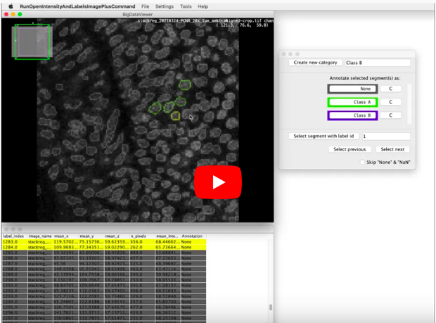
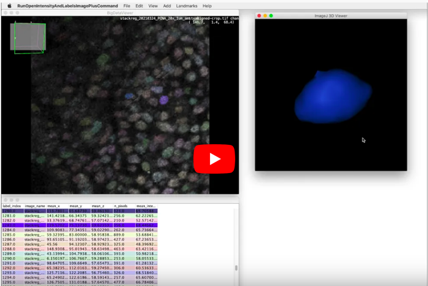

# Segmentation annotator

Fiji plugin for inspection and annotation of segmented images.

## Social media

- [Forum thread](https://forum.image.sc/t/segmented-image-exploration/52303)

## Demonstration movies

#### Explore

#### Annotate

#### Render Objects in 3D

## Install

1. Please install [Fiji](https://fiji.sc) onto your computer.
1. Start Fiji and add the Update Site **SegmentationAnnotator** like this:
   - [ Help > Update.. ]
   - [ Manage update sites ]
      - [X] **SegmentationAnnotator** 
   - [ Close ]
1. Restart Fiji

## Quick start

After installation (see above). You can run below ImageJ macros to launch the application:

- [Minimal 2D segmented image exploration](https://raw.githubusercontent.com/tischi/segmentation-annotator/master/scripts/2d-image-two-objects.ijm)
- [A bit larger 3D segmented image exploration](https://raw.githubusercontent.com/tischi/segmentation-annotator/master/scripts/3d-image-many-objects.ijm)

## Run

After installation the following entries are available in the ImageJ menu:

- **[ Plugins > Segmentation > Annotator > Open Dataset from Table... ]**
  - Experimental (Do not use yet).
- **[ Plugins > Segmentation > Annotator > Open Intensity and Label Mask Image... ]**
  - Allows you to select an intensity image and label mask image from the currently open images.
  - It will automatically compute few basic features of the segmented objects. 
- **[ Plugins > Segmentation > Annotator > Open Intensity and Label Mask Image and MorpholibJ Results Table... ]**
  - As the command above but you can in addition select an object measurements table generated with [MorpholibJ](https://imagej.net/plugins/morpholibj).

## Use

- Mouse: `Right click`: Shows a context menu through with most functionality can be accessed.
- Mouse: `Ctrl + Left-Click`: Selects/Deselects the image segment at the location of the mouse pointer.

